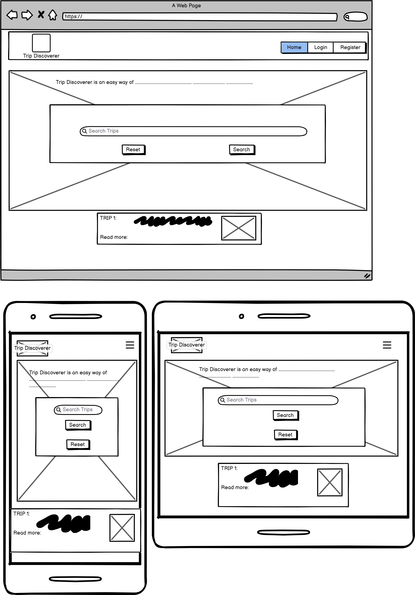
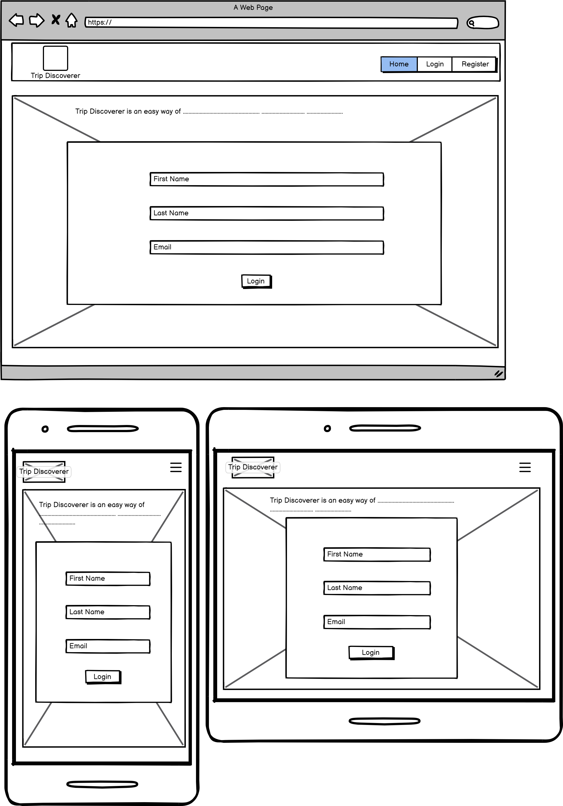
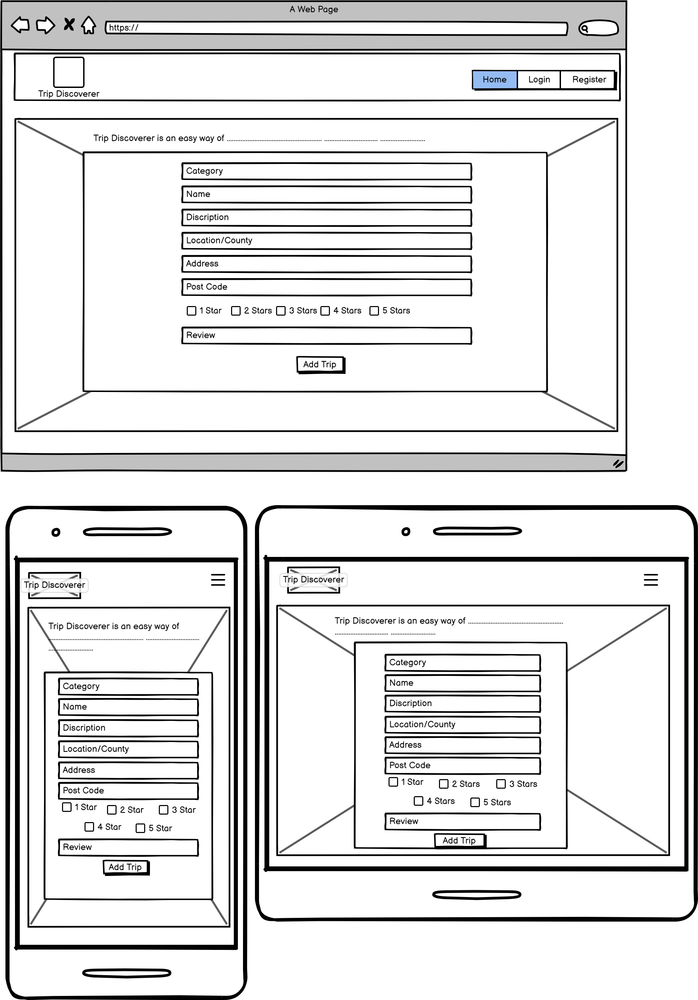

# Third Milestone Project

# Trip Discoverer

## Table of Contents

- [Third Milestone Project](#third-milestone-project)
- [Trip Discoverer](#trip-discoverer)
- [Table of Contents](#table-of-contents)
- [Project Rationale](#project-retionale)
- [About](#about)
- [User Experience (UX)](#user-experience-ux)
  - [User stories](#user-stories)
- [Design](#design)
  - [Colour Scheme](#colour-scheme)
  - [Typography](#typography)
  - [Imagery](#imagery)
  - [Wireframes](#wireframes)
  - [Flowcharts](#flowcharts)
- [Trip Discoverer Pages](#trip-discoverer-pages)
  - [Home Page](#home-page)
    - [Filter section](#filter-section)
    - [Edit and delete trip section](#edit-tip-and-delete-trip-section)
  - [Sign up and sign in pages](#sign-up-and-sign-in-pages)
  - [Add trip and edit trip pages](#add-trip-and-edit-trip-page)
  - [Users page (admin only)](#users-page-admin-only)
- [Accessibility](#accessibility)
- [Technologies used](#technologies-used)
- [Deployment](#deployment--local-development)
- [Testing](#testing)
- [Bugs](#bugs)
- [Credits](#credits)

# About

Trip Discoverer is an easy to use website, designed for anyone to access. The website provides up to date and 
clear information, for anyone looking for a nice day out. The options range from family to adult to kid friendly places. Users can also sign in and add their own Trips for the benefit of others.

## User Experience (UX)

### User Stories

#### Website Owner Goals

- We want the website to attract a new and wide range of users.
- We want an attractive website, where the information is clear, and easy to access.
- We want the users to have the ability of signing in, to add their own trip ideas.
- We want to be able to collect data from all users, to find their preferential category of trips, and places they visit.
- We want to be able to provide consumer habit information, to small local businesses, to promote their business to our users.
- We want the website to be responsive to all devices.

#### Site Visitor Goals

- I want to have access to clear details regarding all the trips detailed by the website.
- I want to be able to easily search for my preferred trip, by location and category.
- I want to add my own trip ideas to the website's database.
- I want to be able to edit my trip ideas on the website's database.
- I want the site to be responsive to my device.
- I want the site to be easy to navigate.

# Design

### Colour Scheme

I designed my colour scheme, based on the Trip Discoverer logo. For the logo design I used the website [Canva](https://www.canva.com/). Based on the colour of the logo I have designed the website.

- I have used `#1a4d2e` for the dark text in the light background sections of the web pages.
- I have used `#1a4d2e` for the dark backgrounds of the web pages.
- I have used `#bacd92` for the coloured light text in the dark background sections of the web pages.
- I have used `#bacd92` for the light background in a few sections of the web pages.
- I have used plain white `#fff` for the white text in the dark background sections of the web pages.
- I have used plain white `#fff` for the white background for many sections of the web pages.

### Typography

The font used in this app is Poppins, this font was suggested for the logo by [Canva](https://www.canva.com/). This font gives a strong presense which makes reading the information very clear. The font is available in a wide range of weights.
The fonts are imported from google fonts [Poppins](https://fonts.google.com/?query=poppins) it is used via the import link at the head of the [stylesheet](assets/css/style.css), this links all the text across the pages of the website to the appropriate style and font.

### Imagery

I have used a beautiful image of a car speeding off on a trip, for the hero image. This image, is downloaded with a full license from [piaxabay](https://pixabay.com/photos/car-transportation-travel-road-trip-6603726/).

## Wireframes

Wireframes were created for mobile, tablet and desktop using balsamiq.

### Home Page

* The next wireframes cover the same layout. The Register page and Login page share layout, and the New Trip and Edit trip pages share layout. I have therefore, provided one wireframe for each group.

### Register / Login Page

### New / Edit Trip Page

## Flowcharts

- The flowcharts below, show how the app is designed, to allow users easy navigation across all sections, and functions of the app. I have also colour coded the for functions CRUD (create, read, update, and delete), each of the functions are coloured in the flowchart showing how the app follows these four criteria.

### Admin flowchart

### User flowchart

 - - -

# Trip Discoverer Pages

## Features

The app is comprised of a Home (trips) page, a sign-up page, a sign in page, an add trip page & a users page for admin only.

All Pages on the website are responsive and have:

* A favicon in the browser tab.

* The app's logo is at the top of every page. The logo is also a link to the home page.
  

### The Home (Trips) Page

The home page of Trip Discoverer displays the sites name/logo as a title and then a nav bar shows the links to the other pages, on mobile the links are in the side toggle. Below the navbar is the hero image at the top of the image is the search bar, users can search for a trip using any word, related to the trip they may be looking for. The search could be for the country, or the city or even words found in the description or the review of the trips. Below this is a small box of information text, describing what the app does. There is a Sign-up button in the information box, the button is only there if no user is in session. The button takes the user to the sign in page. Below the hero image all the trips are displayed in display boxes, the boxes open - revealing all the relevant information of the trip - when clicked on. On the left of the page is a filter by category section [see below](#filter-section).

#### Filter section

The filter by Category section is designed for users to filter out any trip category they are not looking for. The method I implemented to develop the filter, was not researched. I decided to recreate the search input section, I gave it a value of the specific category to be filtered; by putting the category name on the search button and hiding the display of the search bar, I have created a filter. Repeating this for all the categories created the list of filters shown below.

#### Edit tip and delete trip section

After opening the trip information slide down, there is an option for the user which added that trip to either edit or delete the trip.

After clicking on the delete button a confirmation is displayed.

### Sign up and Sign in pages

The sign up and sign in pages are of the same design, both are a simple form asking the user to enter username and password. In the sign-up form the user is prompted to include email.

### Add trip and edit trip page

The user can sign in, head to the add trip page and fill in the details of the trip he wants to add in. The rating section is a number input where the user can input a number from 1 to 5. This will render the number of solid stars displayed on the trips page by each trip. A https link, to the website of the trip can also be added. The edit page is the same form with all the details filled in ready to be edited.

### Users page (admin only)

The users page is only accessible when the admin has signed in. On the page, the admin can view all signed up users, their email address and the admin can search each user and view the trips added by that user. Admin can delete any user from the database.

# Accessibility

I have been mindful during coding, to ensure that the website is as accessible friendly as possible. This has been achieved by:

* Using semantic HTML.
* Using a hover state on all buttons on the site, to make it clear to the user that they are hovering over a button.
* Using an active class to show the user which page is currently being used,, by a highlighted nav link.
* Ensuring that there is a sufficient colour contrasts throughout the site.

- - -

## Technologies Used

### Languages Used

HTML, CSS, JavaScript, Python, Jinja

### Frameworks, Libraries & Programs Used

* [MongoDB](https://www.mongodb.com/products/platform/cloud) - Used to save, read, update, and delete all the app's data

* [JQUERY](https://jquery.com/) - 1. To create sliding navbar for mobile. 2. to open and close collapsible displays. 3. To validate user input for categories. 4. To assgn active class to open page.

* [Balsamiq](https://balsamiq.com/) - Used to create wireframes.

* [Git](https://git-scm.com/) - For version control.

* [Github](https://github.com/) - To save and store the files for the website.

* [GitPod](https://gitpod.io/) - IDE used to create the site.

* [Google Fonts](https://fonts.google.com/) - To import the fonts used on the website.

* [Font Awesome](https://fontawesome.com/) - For all icons displayed

* [Google Developer Tools](https://developers.google.com/web/tools) - To troubleshoot and test features, solve issues with responsiveness and styling.

* [Heroku](https://id.heroku.com) For deployment.

* [Am I Responsive?](http://ami.responsivedesign.is/) To show the website image on a range of devices.

* [Web Disability Simulator](https://chrome.google.com/webstore/detail/web-disability-simulator/olioanlbgbpmdlgjnnampnnlohigkjla) - A google chrome extension that allows you to view your site as people with accessibility needs would see it.

* [Online Converter](https://www.online-convert.com/) To convert test imagery into gif files.
- - -

## Deployment & Local Development

### Deployment

### Github Deployment

The website was stored using GitHub for storage of data and version control. To do this I did the following;

After each addition, change or removal of code, in the terminal within your IDE (I used gitpod for this project) type:

- git add .
- git commit -m "meaningful commit message"
- git push

The files are now available to view within your github repository.

### Local Development

#### How to Fork

To fork the repository:

1. Log in (or sign up) to Github.
2. Go to the repository for this project, [e-h-dev/trip-discoverer](https://github.com/e-h-dev/trip-discoverer)
3. Click the Fork button in the top right corner.

#### How to Clone

To clone the repository:

1. Log in (or sign up) to GitHub.
2. Go to the repository for this project, [e-h-dev/trip-discoverer](https://github.com/e-h-dev/trip-discoverer)
3. Click on the code button, select whether you would like to clone with HTTPS, SSH or GitHub CLI and copy the link shown.
4. Open the terminal in your code editor and change the current working directory to the location you want to use for the cloned directory.
5. Type 'git clone' into the terminal and then paste the link you copied in step 3. Press enter.

### Repository deployment via Heroku

- On the [Heroku Dashboard](https://dashboard.heroku.com) page, click New and then select Create New App from the drop-down menu.
- When the next page loads insert the App name and Choose a region. Then click 'Create app'
- In the settings tab click on Reveal Config Vars and add the key IP and the value 0.0.0.0. The key Port and the value 5000. The credentials for this app were:

1. IP (0.0.0.0)
2. MONGO_URI
3. Port (5000)

### Deployment of the app

- Click on the Deploy tab and select Github-Connect to Github.
- Enter the repository name and click Search.
- Choose the repository that holds the correct files and click Connect.
- A choice is offered between manual or automatic deployment whereby the app is updated when changes are pushed to GitHub.
- Once the deployment method has been chosen the app will be built and can be launched by clicking the Open app button which should appear below the build information window, alternatively, there is another button located in the top right of the page.

- - -

## Testing

Please refer to [TESTING.md](TESTING.md) file for all testing carried out.

- - -

# Bugs

## Solved Bugs

| Number | Bug | Failed Attempt to fix | How I fixed the bug |
| :--- | :--- | :--- | :--- |
| 1 | When updating font-size in the navbar the size would not update from the generic materialize font. | N/A | Looking in devtools, I saw font-size in style.css was not working, since the original font-size was on the materalize css as 15px. I updated the class 'fonts' on each of the nav list items rendering the larger font. |
| 2 | The register form was not working; rendering a flask error. | N/A | I had put the wrong name attribute for the password input. |
| 3 | To create a delete confirmation message, I tried to create a button which activates a JavaScript function creating a new button to the DOM with a `href` link to the python delete function. This did not work. | I realised, since the python route which the delete function activates is a backend function connecting the app to the mongo data base. However, the JavaScript function will only speak to the DOM as a front-end html builder rendering the `url_for` to the python function useless. To fix this issue I checked the `href` in devtools, where an id number was rendered by the python function via the `url_for`. I copied this id based link, and updated the `href` which JavaScript was creating for the DOM, this fixed the bug, and the delete button created by JavaScript deleted the trip. The fix failed, because it only worked for the trip with that id, no other trip could be deleted. | To fix this bug I wrote the html for the confirmation and hid it with display none in css. The JavaScript function changes the display properties of both buttons hiding the first delete button and revealing the confirmation button. This fixed the main problem, but it created another bug. (see bug 4) |
| 4 | The fix in bug 3 caused a second bug. The JavaScript function only worked on the first trip of the list, for the rest of the items on display the delete button was inactive. | N/A | The reason for this bug was, I targeted the HTML elements with JavaScript via the ids. In JavaScript only one identical id could be used. I changed the JavaScript function to target the HTML `class`, then created a for loop to iterate over all instances of the class, this way the delete confirmation is active on all trips displayed. |
| 5 | When logging into the admin account, the page layout was distorted and most of the trip displays would not open. | N/A | After studying the code I realised the classes to connect the JavaScript were not in the correct place in the admin section of the jinja `if` statement. By resetting the classes in html the page loads correctly. |
| 6 | Date stamp format was not clear it included even the milliseconds. | I created three python variables for the day, month, and year. I then created another variable to concatenate all the variables (day, month, and year). This came as a rounded number, since python date function is an integer. I then wrote the code as `date_stamp = day, month, year` this became an array (list in python terms) and displayed as an array on the app Added on: [7, 8, 2024] and in MongoDB. This format was not appealing. | To fix this bug I converted the day, month and year variables into strings and then concatenated them with a hyphen like this `date_stamp = str(day)+"-"+str(month)+"-"+str(year)`, resulting in a better format (Added on: 8-8-2024). |
| 7 | In the form sections of the app even the required inputs accepted white space. | The Pattern attribute I originally used to determine there can be no white space, caused another bug since the input will not accept two words with a space between, this cannot work for the add trip page. | After some research I found busing the pattern attribute `pattern=".*\S+.*"` this allows white spaces, but only after a letter, number or character. |
| 8 | Active nav link would not work like my previous projects since the app's html pages were built with the flask templates. I wanted the nav bar to remain in the base template. | N/A | After some research I found a [YouTube tutorial](https://www.youtube.com/watch?v=sIGPwvd-nTk) dealing with this exact problem. I did not follow it entirely, but the main idea was to use jQuery, by creating a new block at the bottom of each template just before the body end. The code removes the active class from every other `id` beside for the current page this ensures that only on the open page the active class highlights its link" | 

### Known bugs

- I had tried to create a search bar on the users page for admin to search users by name, I created a new python `@route` and connected the search to the template. When searching for users the search came up empty. I am still trying to resolve this issue, and in the future, I would like to add this feature to the app.

## Credits

### Media

All the pictures through the pages of the website are downloaded with a license, from [Pixabay](https://pixabay.com/). Follow this [link](https://pixabay.com/service/terms/) to see the terms and conditions of downloads from pixabay.

### Acknowledgments

I would like to acknowledge the following:

* Jabril Akolade - My Code Institute Mentor.

* Jessica Bessey - Of Newcastle College for helping in facilitating the course.

* Code institute - For all the help and well-structured lessons making this project possible after only three months of learning HTML.

* Customer support at Heroku - For helping me get back into my Heroku account after I had difficulties verifying my account.

* Dan Adiletta - For his [YouTube tutorial](https://www.youtube.com/watch?v=sIGPwvd-nTk).

* [Online convert](https://www.online-convert.com/) for converting hero image from jpg to webp.